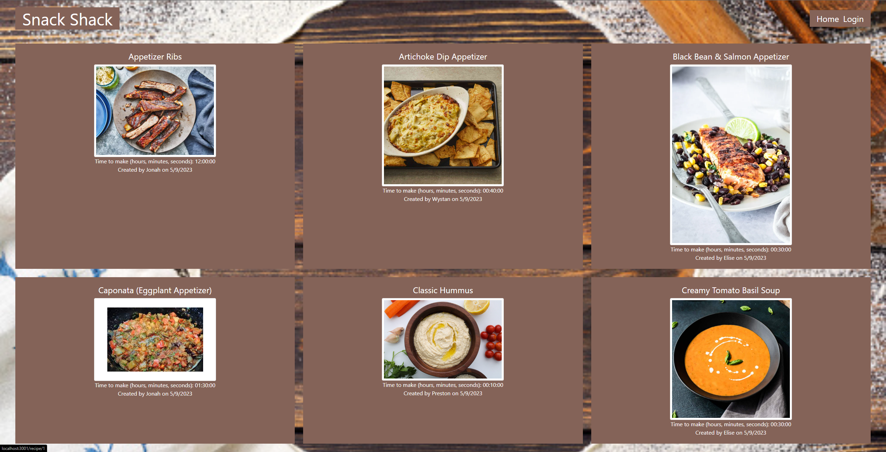
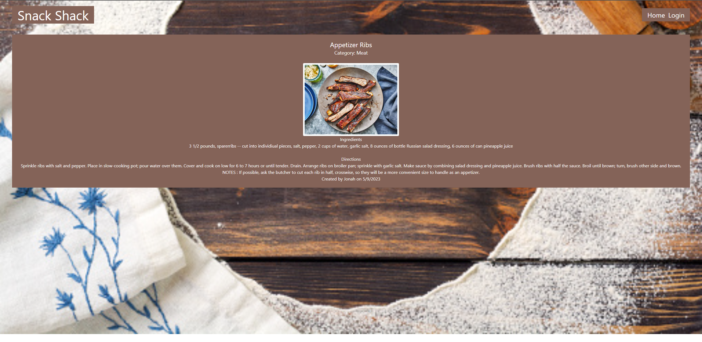
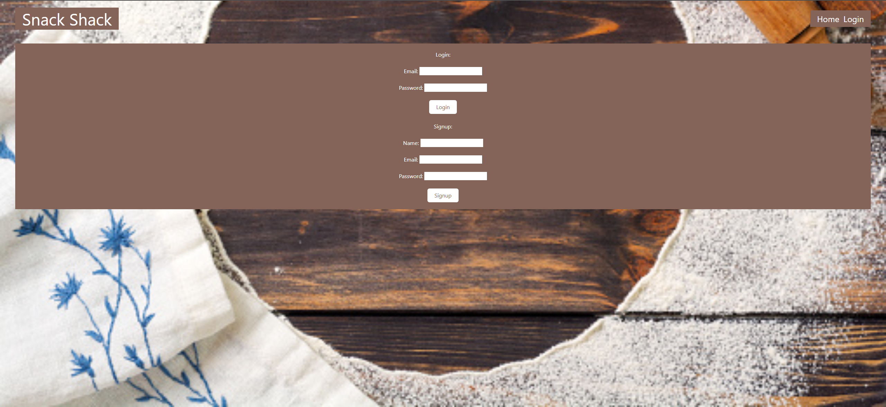
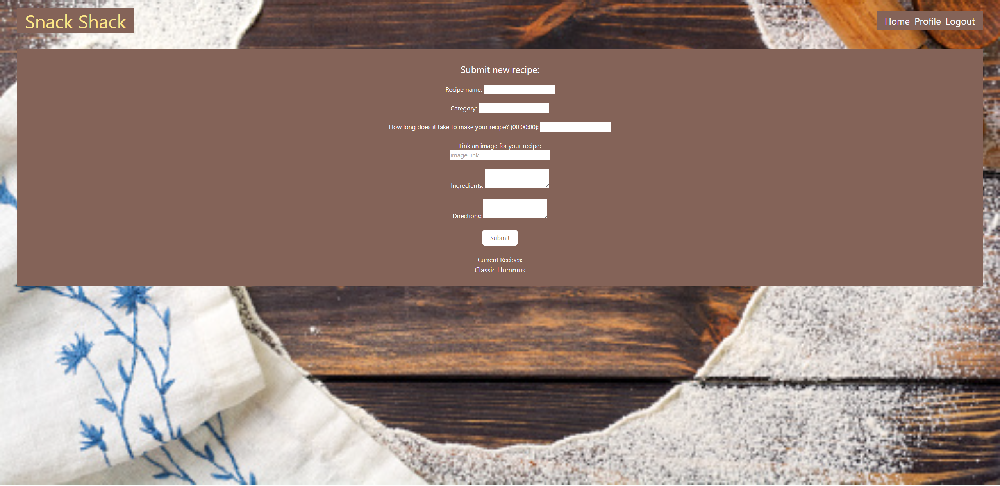

# Snack Shack

## Description

Snack Shack is a recipe database that is very simple to use. A user will only need to access our URL at [Snack Shack](https://floating-reef-78228.herokuapp.com/). Once a user navigates to our site, they can view any recipe that is currently available. The real fun begins when a user creates and logs into their account. Once a user has an account, they will be able to upload a recipe directly to our database that will then be shared with other users!

## Installation

There is no installation for our project, the user will simply have to navigate to [https://floating-reef-78228.herokuapp.com/](https://floating-reef-78228.herokuapp.com/). Once there, the user will be able to view existing recipes without having an account or logging in. To create an account, the user will just need to create a username and password, as well as provide their email address.

## Usage

1. Navigate to [Snack Shack](https://floating-reef-78228.herokuapp.com/).

2. Click on a recipe to view the instructions.

3. Click the login link to be redirected to the login page.

4. If you don't have an account, create one using your username, email and password.
   If you do have an account, login using your credentials.

5. Start uploading recipes! 

## Collaborators & Roles

Thomas Shea - Project Manager/Routing, Tailwind Implementation

Brian Adams - Models, Uploading Recipe Functionality

Ethan Armstrong - Database Seeding and maintenance

Ian Heap - Front-end Development, 

## License

This application uses the MIT License.

## Technologies
The following packages were used in the development of this project:

- node.js
- Express.js
- MYSQL
- Sequelize
- dotenv
- bcrypt
- Express-Handlebars
- Express-Session
- TailwindCSS
- 

